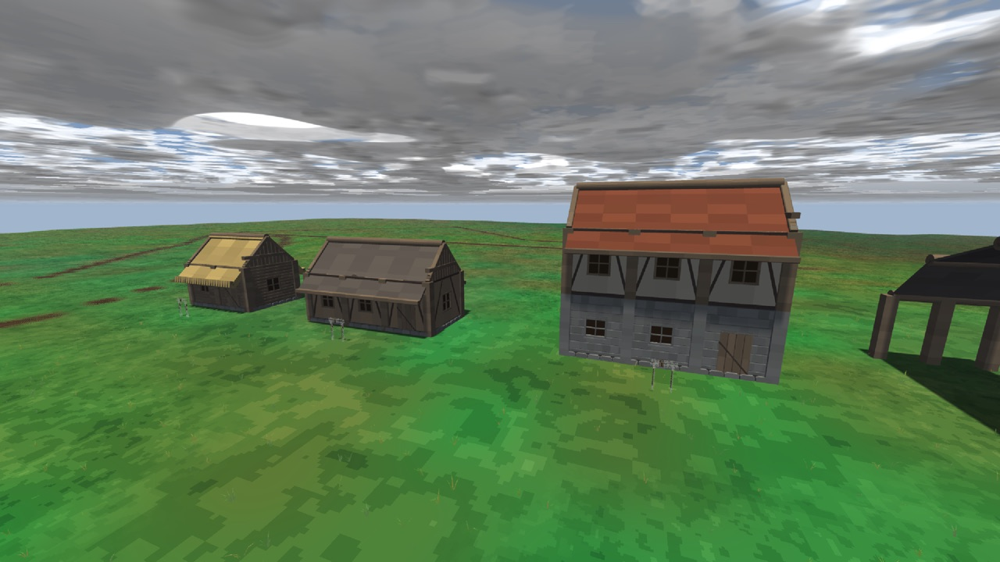
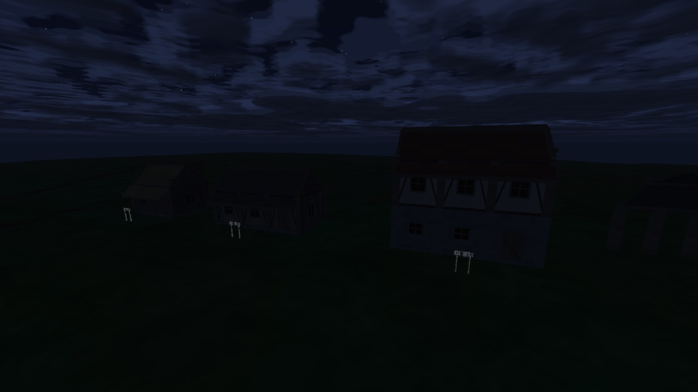
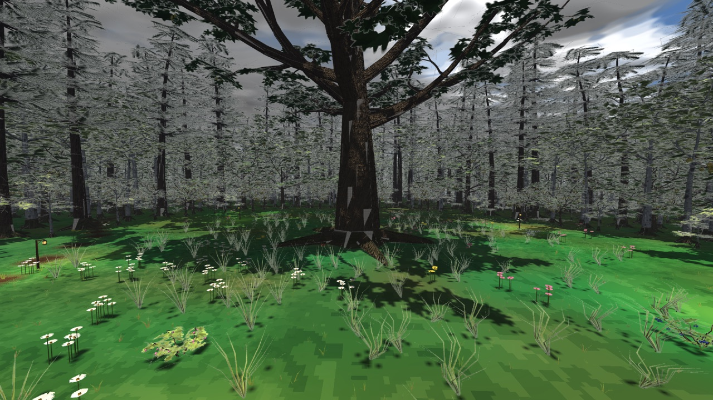
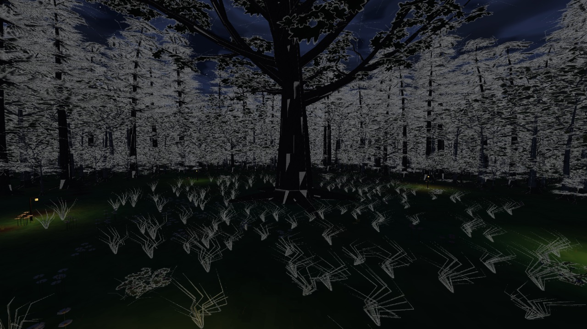

# Daggerfall N

| | |
|:---:|:---:|
|  |  |
|  |  |

*Демка домов и полянка с дубом-старейшиной, день и ночь. Кадры сняты из игры одним
бинарником — те же миры, что открываются из меню.*

---

## Что это

Ролевая игра от первого лица в духе старших Elder Scrolls — Daggerfall и Morrowind:
свобода передвижения, дом, в который заходишь, лес, по которому идёшь, и мир,
сделанный руками, а не сгенерированный на лету.

Три решения отличают её от типичного проекта такого рода.

**Мир конечный и сюжетный, а не бесконечный.** Никакой генерации в момент игры:
всё содержимое печётся заранее в реестр объектов и раскладывается по картам.
Процедурные кузницы (деревьев, строительных деталей) работают на этапе выпечки —
в игре они уже не запускаются.

**Дома собираются из готовых деталей, а не пишутся кодом.** На полке 2411 деталей:
брус, столб, доска, стеновая панель, фронтон, скат, лестница, дверь, окно,
фундамент, забор — в разных материалах и степенях износа. Дом — это композиция,
и она лежит в репозитории текстовым файлом, который можно читать и сливать в git.

**Правила постройки проверяются кодом, а не глазами.** Судья сцены знает, что
панель стены обязана сидеть в двух стойках-шарнирах; что пол и потолок держатся
на горизонтальных шарнирах, а не висят в воздухе; что к квадратной стойке нельзя
пристыковать больше четырёх стен, а к N-угольной — больше N; что над лестницей
обязан быть проём, в который проходит игрок, и его длина ВЫВОДИТСЯ из уклона
марша и роста персонажа, а не выбирается на глаз. Ни одно дерево не встанет на
тропу и ни один дом не встанет поверх дерева.

## Что сделано

**Мир и картинка.** Воксельная земля с LOD и подгрузкой чанками, реверсивная
глубина, MSAA на внутреннем буфере, палитровый пост-эффект (по желанию — вид
DOS-эры), небо с солнцем, луной, звёздами и облаками, время суток, тени,
точечные источники света. Тропа — свойство самой земли, а не текстура поверх.

**Флора.** Кузница деревьев по схеме Вебера — Пенна: дубы, берёзы, осины,
можжевельник, ели. Листва — карточки с альфа-вырезом на своём атласе. Полянка с
цветами, кустами, грибами, травой и светлячками. Отдельно — колосс класса
Элдерглима высотой около 200 метров.

**Дома и город.** Строительный набор и его второй уровень: из мелких деталей
собираются панели, панели замораживаются в единый объект. Демка домов разной
этажности, витрина из 66 образцов стен, крыш, соединителей и декора — у каждого
образца табличка с текстом. Арка-навес, показывающая, что скат есть звено между
двумя шарнирами, а не «крыша»: шарниры по прямой дают двускатную кровлю, по дуге —
свод. Лестничная клетка с объявленным проёмом.

**Персонаж и физика.** Jolt: капсула игрока, шаг, приседание, наклон, бег;
столкновения с домами считаются по треугольникам, а не по коробкам.

**Инструменты.** Кузницы деталей, деревьев и табличек; сборщик замороженных
объектов; судья сцены с набором правил и живыми контрольными сценами на каждое;
создатель новых карт; редактор с летающей камерой, отладочными приборами и
снимками состояния. Ассеты пекутся при первом запуске, а не хранятся в git.

## Идеи, которые ещё впереди

- Город на холме за каменно-деревянной стеной: 15–20 домов, замок с залами и
  троном, торговая площадь, река одним рукавом через город и рвом вдоль стены.
- Вход в дома через экран загрузки: интерьер грузится отдельной сценой, снаружи
  и внутри дом совпадает один в один — никаких искусственных расширений.
- Постройка мышью прямо в игре: палитра объектов, призрак под прицелом, зелёная
  и красная подсветка допустимых мест. Цвет считает тот же судья, что проверяет
  карты, — редактор не может разрешить то, что судья запретит.
- Кисти рельефа, выбор поверхности, посадка и прополка растительности.
- Утварь интерьеров: кровати, камины, ковры из шкур, столы, полки с едой и
  книгами.

## Зависимости

Все внешние библиотеки скачиваются и собираются **автоматически** при
конфигурации CMake (`FetchContent`), с точно закреплёнными версиями — ставить
руками ничего не нужно.

| Библиотека | Версия | Зачем |
|---|---|---|
| [bgfx](https://github.com/bkaradzic/bgfx.cmake) | v1.153.9398-566 | графический бэкенд (на macOS — Metal) |
| [GLFW](https://github.com/glfw/glfw) | 3.4 | окно, ввод, полный экран |
| [Jolt Physics](https://github.com/jrouwe/JoltPhysics) | v5.2.0 | физика и столкновения |
| [GLM](https://github.com/g-truc/glm) | 1.0.1 | векторы и матрицы |
| [miniaudio](https://github.com/mackron/miniaudio) | 0.11.22 | звук |
| [doctest](https://github.com/doctest/doctest) | v2.4.11 | тесты |

Ставить руками нужно только сам инструментарий сборки:

- **CMake** 3.28 или новее
- **Ninja**
- **Компилятор с C++23**: основной — LLVM clang 22 (на macOS ставится из Homebrew,
  системный AppleClang старше и не тянет часть библиотеки)
- **Git** (CMake скачивает им зависимости)

### macOS

```sh
brew install cmake ninja llvm git
```

### Про другие платформы

Собирается и проверяется **на macOS**: шейдеры пока компилируются только под
Metal, и профили под остальные бэкенды ещё не заведены. bgfx, GLFW и Jolt
кроссплатформенны, так что портирование — это работа над шейдерами и сборкой,
а не переписывание движка. Но обещать, что оно соберётся под Windows или Linux
сегодня, было бы неправдой: никто не пробовал.

## Сборка

```sh
git clone https://github.com/AmpiroMax/Yaan.git
cd Yaan

cmake -S . -B build -G Ninja \
      -DCMAKE_BUILD_TYPE=RelWithDebInfo \
      -DCMAKE_CXX_COMPILER=/opt/homebrew/opt/llvm/bin/clang++   # macOS: clang из Homebrew

cmake --build build -j8
```

Первая конфигурация дольше остальных: CMake скачивает и собирает bgfx, Jolt и
GLFW. Дальше пересборка идёт по изменённым файлам.

## Запуск

```sh
./build/engine/app/dfn_app
```

**Первый запуск сам печёт ассеты** — детали домов и таблички — и показывает
полоску прогресса: «готово m из n». Это несколько секунд. Испечённые объекты
в репозитории не хранятся: они полностью выводятся из кода, и держать их в
истории значило бы платить весом репозитория за то, что делается за секунды.

### Управление

| Клавиша | Что делает |
|---|---|
| WASD, Space/E, Ctrl/Q | движение; в редакторе — полёт |
| Shift | бег |
| Tab | переключиться между игроком и свободной камерой |
| M | карта |
| F11 | полный экран |
| Esc | меню и пауза (в редакторе — сохранить карту, выйти без сохранения, в главное меню) |
| 1 | вид от третьего лица |
| 2 / F3 | отладочные числа |
| 3 / F2 | снимок состояния |
| 4 / F4 | каркасный режим |
| 5 | снимок экрана |
| B, G | меню постройки и поворот детали |
| / | окно чата с агентами разработки |

Полный список всегда есть в самой игре: меню → управление. Он рисуется из той же
таблицы, из которой клавиши и рассылаются, поэтому не может разойтись с кодом.

## Тесты

```sh
ctest --test-dir build -j8
```

## Инструменты

Собираются вместе с игрой и лежат в `build/`.

| Команда | Что делает |
|---|---|
| `dfn_kit <каталог>` | печёт полку строительных деталей |
| `dfn_forge` | печёт деревья |
| `dfn_signs` | печёт таблички с текстом |
| `dfn_assemble` | замораживает группу деталей в один объект |
| `dfn_scene_check <сцена>` | судит композицию по правилам постройки |
| `dfn_newmap <зона>/<имя>` | заводит новую карту и её композицию |
| `dfn_bake` | печёт мир |

## Настройки

`settings.cfg` создаётся при первом запуске и правится как обычный текст:
внутреннее разрешение, сглаживание, палитра, полный экран, покачивание головы,
нижний порог яркости. Всё, что касается картинки, можно повернуть и прямо из
меню игры.

## Карта репозитория

```
engine/      движок: core, world, render, gameplay, physics, anim, ui, app
  platform/  бэкенды: bgfx, GLFW, Jolt, miniaudio — единственное место,
             где движок знает о внешних библиотеках
tools/       кузницы, судья сцены, создатель карт
assets/      содержимое: карты, композиции, тексты табличек, шейдеры
docs/        архитектура, правила зон, числа, кадры приёмки
tests/       doctest
games/       игра поверх движка: локализация и её данные
```
