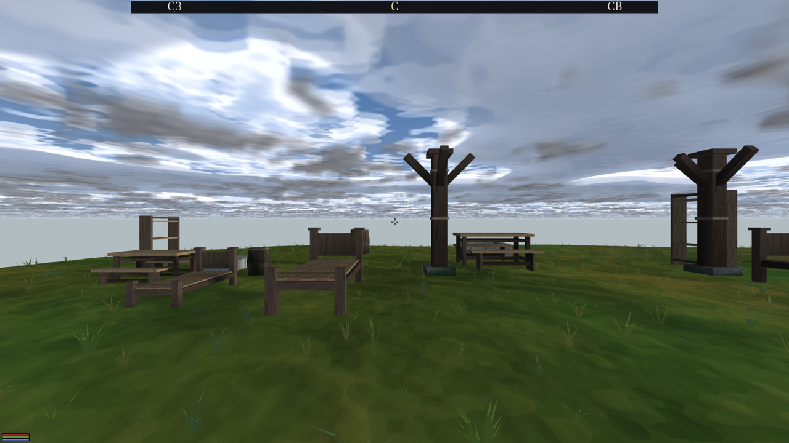
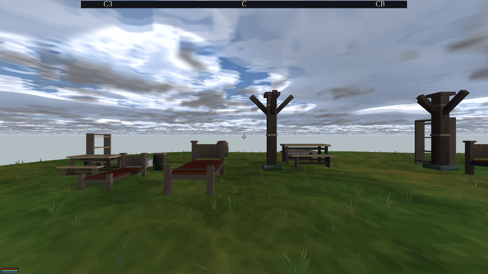
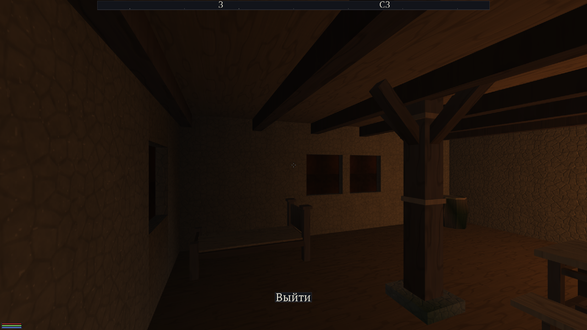

<!--
Created: 27:08:2026 - 15:30:00
Last updated: 27:08:2026 - 15:30:00
-->
<!--
UPD:
- 27:08:2026 - 15:30:00: Создан — приёмка волны кроватей (коммит 9e2c8c9):
  кадры двух рук и доказательство центральности, числами и картинками.
-->

# ПРИЁМКА: КРОВАТЬ — ЕДИНЫЙ ЗАПЕЧЁННЫЙ ОБЪЕКТ РЕЕСТРА

Заказ владельца 27.08, дословно: «Кровати ощущаются не как один объект
запечённый, а что-то нарисованное по месту. Хочу видеть подтверждение
существования их в перечне наших объектов, чтобы точно знать, что они схожим
образом рисуются везде, и если их обновить — они везде обновятся при
необходимости».

Коммит: `9e2c8c9`. Полка: `assets/objects/furniture/`, перечень —
`assets/objects/furniture/INDEX.md`.

## 1. ЗАПИСЬ В ПЕРЕЧНЕ (то, что владелец просил увидеть)

| имя | пятно x | пятно z | низ | верх | треуг. | кусков | хэш |
|---|---|---|---|---|---|---|---|
| `furn-bed` | 1.00 | 1.97 | 0.00 | 0.99 | 276 | 3 | `c584b1d6ab8f060e` |

Габариты ЗАМЕРЕНЫ с самого объекта (`render::measure_object`), а не переписаны
из рецепта: размер, написанный рукой рядом с предметом, — первое, что устареет
молча при следующей перепечке.

**Вид ровно один, и это замер, а не экономия.** В сценах Вайтрана и Корнхолла
кровать одна и та же — 118 расстановок одного рецепта `furn-bed.dfh`, ни одной
второй. Заводить «двуспальную» про запас значило бы положить в перечень
объект, которого нигде нет.

## 2. ОБЛИК НЕ ИЗМЕНИЛСЯ

Слева — кровати, построенные ПО МЕСТУ из чертежа (как было). Справа — те же
кровати, поставленные ССЫЛКОЙ на запечённый объект. Стенд: убранство двух
РАЗНЫХ домов (`city-house-s`, `city-house-l`), обе руки при ВОССТАНОВЛЕННОМ
состоянии мира (`DFN_RESTORE`).

| контроль: чертёж (как было) | объект реестра (стало) |
|---|---|
|  |  |

**Числа важнее картинок.** Разница между руками — **0.568 %** пикселей;
собственный шум прогона (две сборки ОДНОЙ руки) — **0.709 %**. То есть руки
расходятся МЕНЬШЕ, чем рука расходится сама с собой.

Без `DFN_RESTORE` мерить было нечего: облака и ветер дают **37 %** расхождения
на пустом месте, и первая пара кадров показала 32.8 % при шуме 37.1 % —
измерение, которое ничего не значит. Часы пришлось приколотить.

## 3. ЦЕНТРАЛЬНОСТЬ: ОДНА ПРАВКА — ВСЕ КРОВАТИ

Настилу кровати добавлена краска (`paint=3`, красная фалу), объект перепечён
ОДИН раз. Кадр без единой правки сцен:

Покраснели ОБЕ кровати обоих домов (и третья, у правого края). Объект
возвращён исходным, хэш снова `c584b1d6ab8f060e`.

Проба шла через ключ `dfn_furn_objects --houses <папка>`: живая полка домов
(`assets/houses/`) НЕ ТРОНУТА ни байтом — по ней в это же время ходят другие
волны, и чужой чертёж, изменившийся под руками, был бы не пробой, а поломкой
у соседа.

## 4. ЛОКАЦИЯ РИСУЕТ КРОВАТЬ ИЗ РЕЕСТРА

Настоящая локация Вайтрана (PID-копия выпуска), кровать пришла строкой
`[place] object = furn-bed`:

## 5. ЧТО ОСТАЛОСЬ КООРДИНАТОРУ

Боевые сцены городов и локации **не перевыпущены** — по границам волны.
Генератор готов и проверен на PID-копии Вайтрана: 21 ссылка в 18 локациях,
чертежей кровати не осталось ни одного, полка `assets/objects/furniture`
дописана в `objects=` карты. Приёмка `dfn_interior_check` по всему выпуску —
те же 6 находок, что и у боевого выпуска (все шесть про чужую комнату
`x132z182` и старше этой волны).
